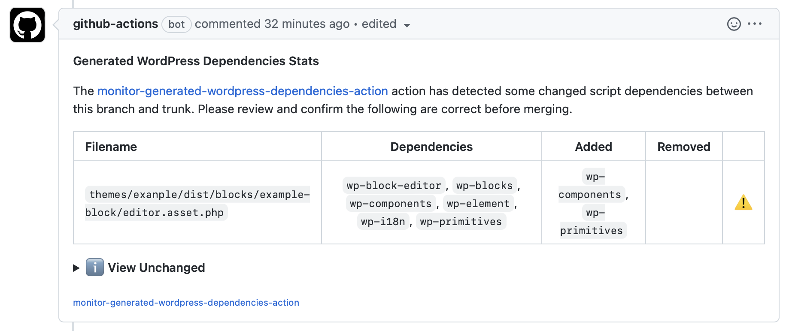

# Monitor WordPress Dependencies Action

A GitHub action that reports changes in WordPress Dependencies generated via the [WordPress DependencyExtractionWebpackPlugin](https://www.npmjs.com/package/@wordpress/dependency-extraction-webpack-plugin).

- Automatically uses `yarn`, `pnpm` or `npm ci` when lockfiles are present
- Builds your PR, then builds the target and compares between the two
- Doesn't upload anything or rely on centralized storage
- Supports custom build scripts and file patterns



> **Note**
> This action is inspired by the incredible [`compressed-size`](https://github.com/preactjs/compressed-size-action) action by the preact team. And [some work by the WooCommerce team](https://github.com/woocommerce/woocommerce-blocks/tree/trunk/.github/compare-assets)

### Usage

Add a workflow (`.github/workflows/main.yml`):

```yaml
name: WordPress Dependencies
on: [pull_request]
jobs:
  build:
    runs-on: ubuntu-latest
    steps:
      - uses: actions/checkout@v2
      - uses: fabiankaegy/monitor-wordpress-dependencies-action@v1
```

### Customizing the Build

By default, `monitor-wordpress-dependencies-action` will try to build your PR by running the `"build"` [npm script](https://docs.npmjs.com/misc/scripts) in your `package.json`.

If you need to perform some tasks after dependencies are installed but before building, you can use a "postinstall" npm script to do so. For example, in Lerna-based monorepo:

```json
{
  "scripts": {
    "postinstall": "lerna bootstrap",
    "build": "lerna run build"
  }
}
```

It is also possible to define a `"prebuild"` npm script, which runs after `"postinstall"` but before `"build"`.

You can also specify a completely different [npm script](https://docs.npmjs.com/misc/scripts) to run instead of the default (`"build"`). To do this, add a **`build-script` option** to your `yml` workflow:

```diff
name: WordPress Dependencies
on: [pull_request]
jobs:
  build:
    runs-on: ubuntu-latest
    steps:
    - uses: actions/checkout@v2
    - uses: fabiankaegy/monitor-wordpress-dependencies-action@v1
      with:
+       build-script: "ci"
```

#### Clean up state between builds

For repositories or custom monorepo setups where files are modified in ways that are not reset by `npm ci && npm run build`, it may be necessary to define a custom "clean" script. This script resets any file modifications after the upstream (`target`) build ends and your PR code (`HEAD`) is checked out, but before installation of npm dependencies for `HEAD`:

```diff
name: WordPress Dependencies
on: [pull_request]
jobs:
  build:
    runs-on: ubuntu-latest
    steps:
    - uses: actions/checkout@v2
    - uses: fabiankaegy/monitor-wordpress-dependencies-action@v1
      with:
        repo-token: "${{ secrets.GITHUB_TOKEN }}"
+       clean-script: "clean"
```

```jsonc
// package.json
{
  "scripts": {
    // example - a simple nested node_modules setup:
    "postinstall": "cd packages && npm i",
    // between the two builds, we need to delete the inner node_modules:
    "clean": "rm -rf packages/node_modules"
  }
}
```

### Customizing the list of files

`monitor-wordpress-dependencies-action` defaults to tracking the size of all `.asset.php` files not within `node_modules` or `vendor` directories - anywhere in your repository, not just at the root. You can change the list of files to be tracked and reported using the `pattern` and `exclude` options, both of which are [minimatch patterns](https://github.com/motemen/minimatch-cheat-sheet/blob/master/README.md):

```diff
name: WordPress Dependencies
on: [pull_request]
jobs:
  build:
    runs-on: ubuntu-latest
    steps:
    - uses: actions/checkout@v2
    - uses: fabiankaegy/monitor-wordpress-dependencies-action@v1
      with:
+       pattern: "./dist/**/*.asset.php"
+       exclude: "{./dist/sample.asset.php}"
```

Files are collected by finding matches for `pattern`, then any of those that match `exclude` are ignored. For that reason, most projects don't need to modify `exclude`. The default values for `pattern` and `exclude` are as follows:

```yaml
with:
  # Any JS files anywhere within a dist directory:
  pattern: "**/*.asset.php"
  # Always ignore SourceMaps and node_modules:
  exclude: "{**/vendor/**,**/node_modules/**}"
```
